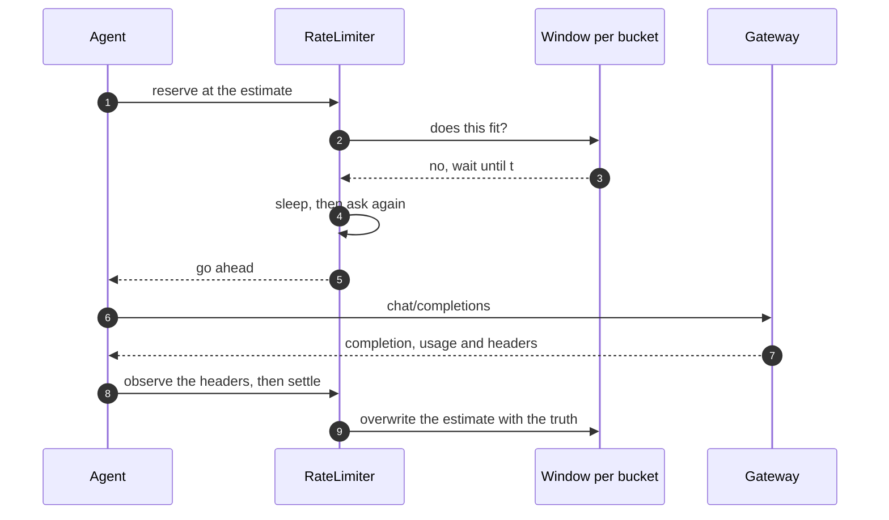
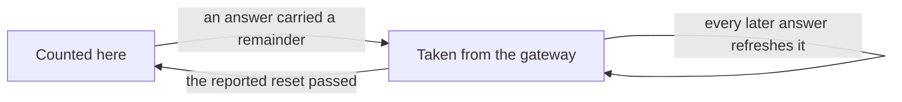
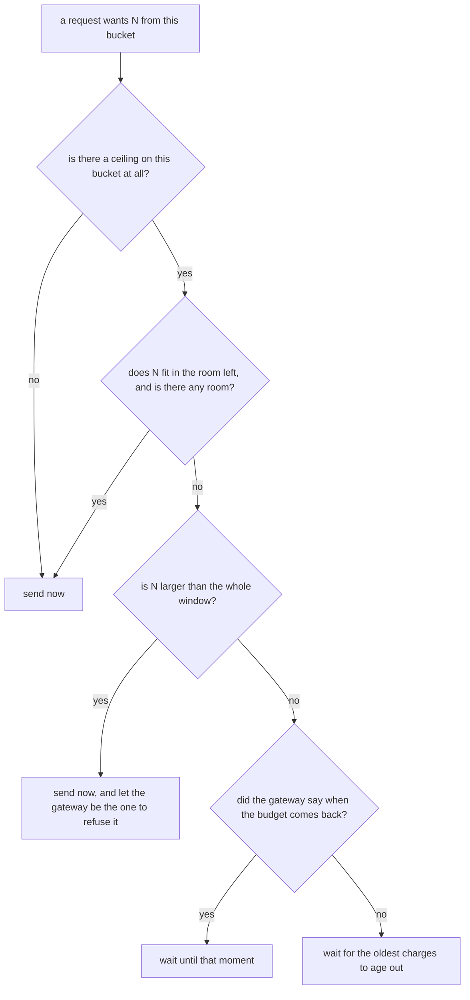
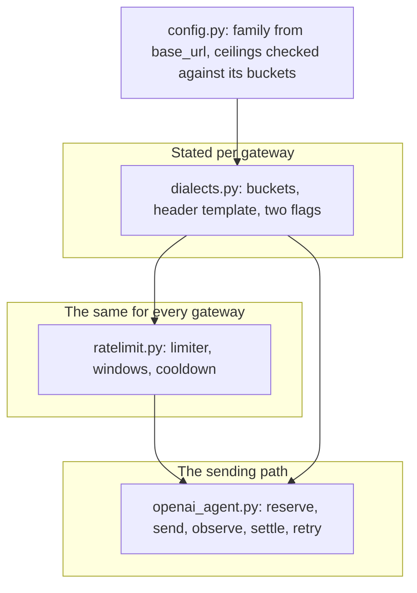

# Rate limits: what gateways meter, and how a run paces itself

A review is a burst. Several checklist items run at once, each resending a large
context every turn for several minutes, and the first thing a hosted gateway
does to an unpaced burst is refuse it. Retrying into a full bucket does not
help — the request has to be held back before it is sent.

Which is easy to write for one gateway and wrong for the next one, because
gateways do not agree on what load *is*. This page is the survey that settled
what the tool does about that, and what it does.

## The survey

Ten gateways, read off their own documentation on 2026-08-10. What matters is
not the numbers — those are per account and move — but the shape: which buckets
exist, and whether the gateway will tell you how full they are.

| Gateway | Buckets | Reports | Window |
| --- | --- | --- | --- |
| OpenAI | RPM, TPM, RPD, IPM | limit, remaining, reset | rolling |
| Groq | RPM, RPD, TPM, TPD, audio seconds; sometimes input/output split | limit, remaining, reset | rolling |
| Mistral | RPS, TPM, tokens per month | limit, remaining | rolling |
| Anthropic | RPM, input TPM, output TPM | limit, remaining, reset (as a timestamp) | token bucket, refilled continuously |
| Fireworks | prompt, cache-adjusted prompt, generated | **limit only** | rolling |
| Together | "dynamic", no published figures | reset only | — |
| OpenRouter | requests (credits are separate, and answer 402) | limit, remaining, reset, unprefixed | — |
| Gemini | RPM, input TPM, RPD | nothing in headers; the hint is in the 429 body | — |
| Azure OpenAI | TPM, with RPM derived from it | retry-after | **sub-minute** — the quota tables show 10-second buckets |
| DeepSeek | **none** — concurrent connections, not a rate | nothing | — |
| vLLM (self-hosted) | **none** — `--max-num-seqs` bounds the batch, the rest queues | nothing | — |

Five things fall out of that table, and each one is a decision in the code.

**Seven of the ten say what is left.** A gateway that reports `remaining` has
already done the arithmetic, and its answer is better than any the run can
compute: it also counts whatever else is spending the same key, which a local
tally cannot see. Fireworks is the outlier that reports a ceiling and never a
remainder, and it is the one this tool was originally written against — so the
outlier was the default. That is now the other way round.

**The bucket sets genuinely differ.** Requests plus one combined token bucket;
requests plus input and output apart; prompt, uncached prompt and generated. A
configuration written in one family's names is meaningless in another's.

**Two gateways meter no rate at all.** DeepSeek limits concurrent connections,
and a self-hosted vLLM has no per-key limiting whatever — it queues, so
over-sending shows up as latency rather than a refusal. The control variable
there is how many agents run at once, which is `run.concurrency`, and a ceiling
invented on such a gateway's behalf only makes a run slower for nothing.

**What the output costs is not universal.** Anthropic states that `max_tokens`
does not factor into its output budget, which is evaluated against what is
actually produced. Booking the ceiling — 8000 tokens on every request — would
hold a run back for a charge that never arrives.

**Sixty seconds is an assumption, not a fact.** Anthropic refills continuously
rather than resetting a window. Azure enforces on sub-minute windows and will
refuse a request while the minute-level figure still looks comfortably under
quota.

One finding cuts the other way, and it is the reason the design did not
fragment further: **the "uncached prompt" bucket is not a Fireworks quirk.**
Anthropic excludes cache reads from its input budget too. Two independent
gateways arrived at the same idea, so it belongs in the shared model rather than
in a per-provider special case.

## What the tool does

The differences above are five answers, not five algorithms. They live as data
in `roboviewer/dialects.py` — a dialect is a bucket
list, a header template and two flags, and there are no subclasses. What is the
same everywhere lives in `roboviewer/ratelimit.py`.

**One budget for the whole run.** Every agent reserves from the same limiter,
because the gateway counts the run as a whole and so must we.

Every request goes round the same loop. What it books on the way out is a guess;
what the answer reports replaces it.



**A cooldown, always on.** When the gateway says 429 — or 503, which is the same
message with a different number — every agent is held back, not just the one
that was refused. The others are a moment away from the same answer, and
hammering is what turns a busy minute into a failed run. `retry-after` wins over
the tool's own backoff: the gateway knows when its budget comes back and we are
guessing. This applies to gateways that meter nothing too, because a refusal is
still a refusal.

**A window per bucket, filled one of two ways.** If the gateway reports what is
left, that is taken as the truth and the run stops guessing. If it reports only
a ceiling, the run keeps its own count: a request is estimated before sending
and corrected the moment the answer arrives, so an estimate that was wrong costs
one request's worth of drift rather than compounding.

Those two are not two mechanisms. A reported remainder is an authoritative
settling of the whole window, so it goes through the same object as everything
else — the local tally is simply what happens when nobody answers.



| State | Where the number comes from |
| --- | --- |
| Counted here | the estimate charged on reserve, corrected on settle |
| Taken from the gateway | `ceiling - remaining`, holding until the reported reset |

**Whether to wait** is then one question asked of each bucket, and the longest
answer across them is the one that counts.



Two of those branches are not obvious. **"And is there any room"** is not
redundant: a bucket at exactly zero would otherwise admit a request that books
nothing against it, because `0 ≤ 0` reads as "it fits" — which is a live hole
the moment a dialect stops booking the output ceiling. And **larger than the
whole window means send it**, because waiting cannot make it fit and hanging
forever is the worst of the three answers.

## The four families

| Dialect | Buckets it meters | How it is paced |
| --- | --- | --- |
| `openai` | `requests`, `tokens` | from the reported remainder; the estimate barely matters |
| `fireworks` | `prompt tokens`, `uncached prompt tokens`, `generated tokens`, `requests` | local count, corrected on every answer; ceilings adopted from headers |
| `anthropic` | `requests`, `input tokens`, `output tokens` | from the reported remainder; cache reads free, `max_tokens` not booked |
| `none` | nothing | not paced at all — `run.concurrency` and the 429 cooldown are the whole mechanism |

`openai` is the default for anything unrecognised, which is what the tool
already claims to speak. It covers OpenAI, Groq and Mistral as they stand.

## Configuring it

Nothing needs setting for the common case. Most gateways advertise their
ceilings on every response, and a figure typed into a config months ago is not
the authority on an adaptive plan.

The family is read off `base_url`. Check what was decided before trusting it:

```bash
roboviewer --check-provider
```

```
  metering     fireworks — three token buckets; ceilings advertised but never the remainder, so the run keeps count
               (matched fireworks.ai in base_url)
  pacing       generated tokens 12000/min · keeping its own count between answers · adopting advertised ceilings
```

Ceilings are written under the bucket names that gateway actually meters, and a
name it does not meter is refused at load time with the valid ones listed —
a setting that would never have applied is worth finding out about before the
run rather than an hour into it.

```toml
[provider.rate_limits]
dialect = "auto"              # name a family when a proxy hides base_url
adopt_advertised = true

[provider.rate_limits.per_minute]
"prompt tokens" = 21600000
"uncached prompt tokens" = 5400000
"generated tokens" = 216000
```

## What this does not fix

**The output reservation is still a ceiling where it is charged at all.** Under
`fireworks` a request books `max_tokens` against the generated bucket because
that is the only number that exists before the answer does. Against a 12k/min
generated budget that is "one and a half agents per minute" while a turn
actually generates a fraction of it, and it is the direct cause of the longest
holds ever measured: 441s, 281s and 233s on single agents. The fix is a rolling
average of settled values — TASK-29, which wants its own measurement.

**A run starting cold can still burst.** The window is empty at the start, so
every agent is entitled to spend the whole minute's allowance in the first
second. The average is respected and the shape inside it is not, while the
gateway's limiter is watching exactly that shape — TASK-32.

**A remainder taken while requests are in flight misses them.** Charges made
before the report are dropped when it lands, so the count is briefly optimistic
by at most the concurrency. On a gateway that reports at all, the next response
corrects it a second later.

**Only Fireworks has been measured.** The other three families are built from
documentation and covered by tests, not by a run against a live account. See
`doc-14` for the numbers that do exist.

## Where the parts are

One axis of variation, isolated. Everything a gateway disagrees about is stated
once, in `dialects.py`; the config resolves which family is in play before the
first request, and both the limiter and the sending path read it from there.



| Part | Where |
| --- | --- |
| What each gateway meters and reports | `roboviewer/dialects.py` |
| Windows, cooldown, reserve and settle | `roboviewer/ratelimit.py` |
| Sending, retrying, pausing | `roboviewer/runners/openai_agent.py` |
| Settings | `[provider.rate_limits]`, `config.example.toml` |
| Tests (no network, fake clock) | `tests/test_ratelimit.py` |
